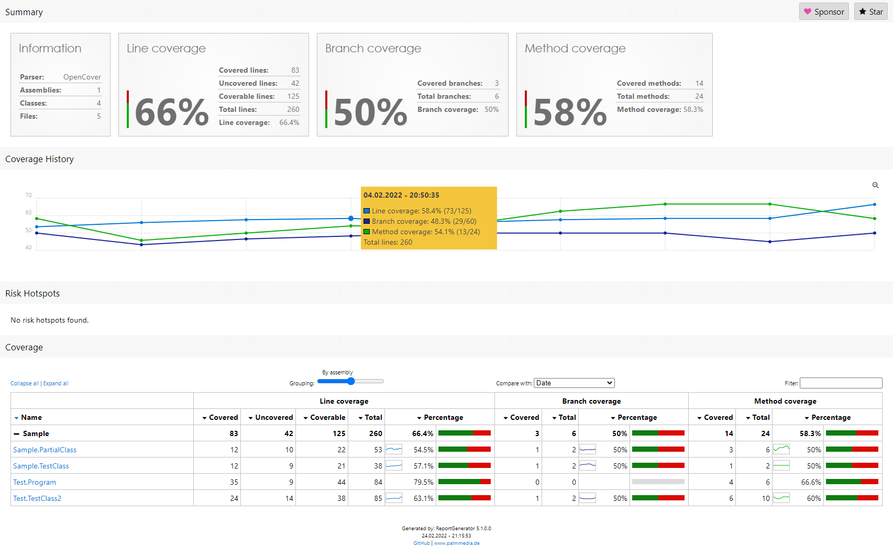
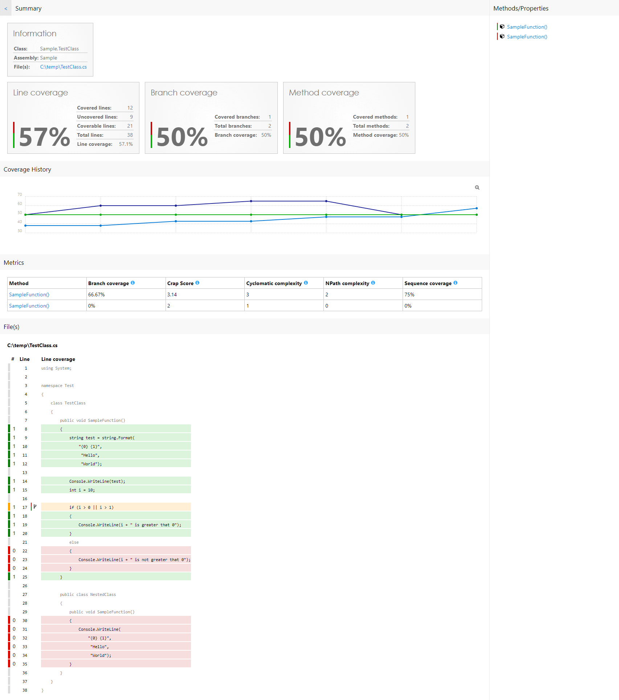

# ReportGenerator
*ReportGenerator* converts coverage reports generated by coverlet, OpenCover, dotCover, Visual Studio, NCover, Cobertura, JaCoCo, Clover, gcov, or lcov into human readable reports in various formats.

Author: Daniel Palme  
Blog: [www.palmmedia.de](https://www.palmmedia.de)  
Twitter: [@danielpalme](https://twitter.com/danielpalme)  

## Usage
To learn how to use *ReportGenerator* have a look at the:
* [Usage Guide](https://reportgenerator.io/usage)
* [Command line parameters](https://github.com/danielpalme/ReportGenerator/#usage--command-line-parameters)

### YAML example
```yaml

- task: reportgenerator@5
  displayName: ReportGenerator
  inputs:
    reports: 'coverage.xml' # REQUIRED # The coverage reports that should be parsed (separated by semicolon). Globbing is supported.
    targetdir: 'coveragereport' # REQUIRED # The directory where the generated report should be saved.
    reporttypes: 'HtmlInline_AzurePipelines;Cobertura' # The output formats and scope (separated by semicolon) Values: Badges, Clover, Cobertura, OpenCover, CsvSummary, Html, Html_Dark, Html_Light, Html_BlueRed, HtmlChart, HtmlInline, HtmlInline_AzurePipelines, HtmlInline_AzurePipelines_Dark, HtmlInline_AzurePipelines_Light, HtmlSummary, Html_BlueRed_Summary, JsonSummary, CodeClimate, Latex, LatexSummary, lcov, MarkdownSummary, MarkdownAssembliesSummary, MarkdownSummaryGithub, MarkdownDeltaSummary, MHtml, SvgChart, SonarQube, TeamCitySummary, TextSummary, TextDeltaSummary, Xml, XmlSummary
    sourcedirs: '' # Optional directories which contain the corresponding source code (separated by semicolon). The source directories are used if coverage report contains classes without path information.
    historydir: '' # Optional directory for storing persistent coverage information. Can be used in future reports to show coverage evolution.
    plugins: '' # Optional plugin files for custom reports or custom history storage (separated by semicolon).
    assemblyfilters: '+*' # Optional list of assemblies that should be included or excluded in the report. Exclusion filters take precedence over inclusion filters. Wildcards are allowed.
    classfilters: '+*' # Optional list of classes that should be included or excluded in the report. Exclusion filters take precedence over inclusion filters. Wildcards are allowed.
    filefilters: '+*' # Optional list of files that should be included or excluded in the report. Exclusion filters take precedence over inclusion filters. Wildcards are allowed.
    riskhotspotassemblyfilters: '+*' # Optional list of assemblies that should be included or excluded in the risk hotspots. Exclusion filters take precedence over inclusion filters. Wildcards are allowed.
    riskhotspotclassfilters: '+*' # Optional list of classes that should be included or excluded in the risk hotspots. Exclusion filters take precedence over inclusion filters. Wildcards are allowed.
    verbosity: 'Info' # The verbosity level of the log messages. Values: Verbose, Info, Warning, Error, Off
    title: '' # Optional title.
    tag: '$(build.buildnumber)_#$(build.buildid)' # Optional tag or build version.
    publishCodeCoverageResults: false # Directly publish report in 'Code Coverage' tab. Makes the 'PublishCodeCoverageResults' task obsolete.
    license: '' # Optional license for PRO version. Get your license here: https://reportgenerator.io/pro
    customSettings: '' # Optional custom settings (separated by semicolon). See: https://github.com/danielpalme/ReportGenerator/wiki/Settings.
```

### Attention
The [PublishCodeCoverageResults@1](https://learn.microsoft.com/de-de/azure/devops/pipelines/tasks/reference/publish-code-coverage-results-v1?view=azure-pipelines) task from Microsoft regenerates the report with different settings and based on the supplied _Coberatura_ file (see [announcement](https://docs.microsoft.com/en-us/azure/devops/release-notes/2019/sprint-150-update#cobertura-code-coverage-report-updates)). Moreover it does not necessarily use the latest version of _ReportGenerator_.  
To disable the regeneration of the report, you can use the following environment variable in your build:
```yaml
disable.coverage.autogenerate: 'true' # Global environment variable

- task: PublishCodeCoverageResults@1
  displayName: 'Publish code coverage results'
  inputs:
    codeCoverageTool: Cobertura
    summaryFileLocation: '$(Build.SourcesDirectory)/coveragereport/Cobertura.xml'
    reportDirectory: '$(Build.SourcesDirectory)/coveragereport'
  env:
    DISABLE_COVERAGE_AUTOGENERATE: 'true' # Local environment variable
```

The [PublishCodeCoverageResults@1](https://learn.microsoft.com/de-de/azure/devops/pipelines/tasks/reference/publish-code-coverage-results-v1?view=azure-pipelines) will get [deprecated](https://devblogs.microsoft.com/devops/new-pccr-task/).  
Microsoft recommends to use the [PublishCodeCoverageResults@2](https://learn.microsoft.com/de-de/azure/devops/pipelines/tasks/reference/publish-code-coverage-results-v2?view=azure-pipelines) instead.  
The new version has several disadvantages regarding the report in the `Code Coverage` tab within Azure DevOps
- No branch and method coverage
- No details page for each class

**Recommendation**:  
Use the setting `publishCodeCoverageResults: true` of the *ReportGenerator* task. This way you don't have to use the *PublishCodeCoverageResults@1* or *PublishCodeCoverageResults@2* task at all.  
```yaml
- task: reportgenerator@5
  displayName: ReportGenerator
  inputs:
    reports: 'coverage.xml'
    targetdir: 'coveragereport'
    publishCodeCoverageResults: true
```

If you want to use the *PublishCodeCoverageResults@2* task you could additionally create an artifact containing the full coverage report generated by *ReportGenerator*. You can download the artifact and get full report with all features:
```yaml
- publish: $(Build.SourcesDirectory)/coveragereport
  artifact: CoverageReports
```

## Screenshots
The screenshots show two snippets of the generated reports:


